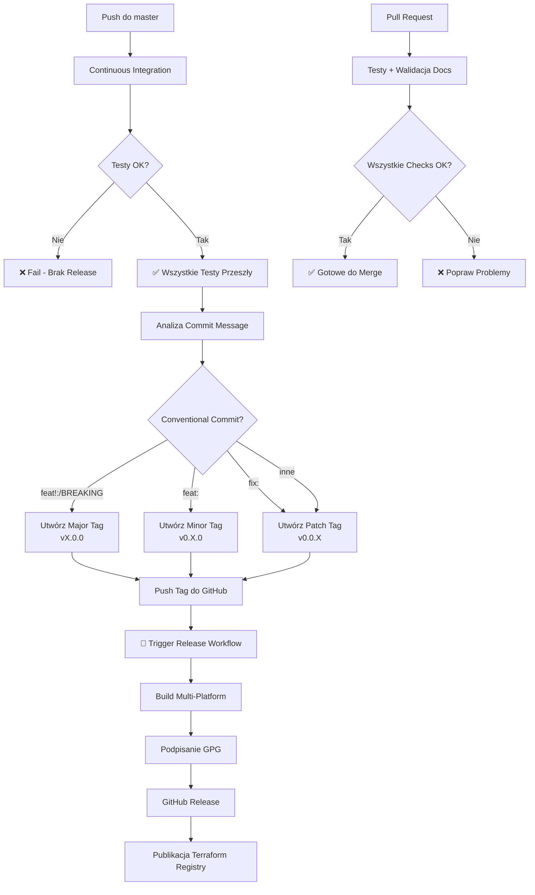

# CI/CD Workflows

System CI/CD dla Terraform Provider MikroTik z automatycznym przepływem: **Test → Tag → Build → Publish**

## 🔄 Jeden Ciągły Pipeline

**Kompletny automatyczny przepływ:**

```
Push → Testy → ✅ Sukces → Auto Tag → 🚀 Build & Publish
```

Nie wymaga żadnej ręcznej interwencji - sukces testów automatycznie triggeruje wersjonowanie i publikację!

## 📋 Workflow

### 1. **Continuous Integration** (`continuous-integration.yml`)

**Główny workflow - obsługuje testy, tagowanie i triggerowanie release**

**Trigger**: 
- Push do `master`/`main`
- Pull requests

**3 Fazy Wykonania:**

#### Faza 1: Build & Test
- Kompilacja na Go 1.22 i 1.23
- Weryfikacja zależności (`go mod verify`)
- `go vet` - analiza statyczna
- Testy jednostkowe (`./mikrotik/internal/...`)
- Kompilacja testów akceptacyjnych (walidacja składni)

#### Faza 2: Lint
- `golangci-lint` - analiza jakości kodu

#### Faza 3: Auto Tag & Release (tylko push do master)
**Uruchamia się TYLKO po sukcesie testów!**

1. Analiza commit message dla version bump:
   - `feat!:` lub `BREAKING CHANGE:` → major (vX.0.0)
   - `feat:` → minor (v0.X.0)
   - `fix:` → patch (v0.0.X)
   - inne → patch

2. Utworzenie i push tagu wersji

3. **Tag automatycznie triggeruje Release Workflow**

**Status**: ✅ Aktywny

---

### 2. **Release** (`release.yml`)

**Buduje i publikuje binaria providera**

**Trigger**: 
- Nowe tagi wersji (v*.*.*)
- Ręcznie przez workflow dispatch

**Proces**:
1. Import klucza GPG do podpisywania
2. GoReleaser - build multi-platform binaries
3. Podpisanie artefaktów GPG
4. Utworzenie GitHub Release
5. Publikacja do Terraform Registry

**Platformy**: 
- Linux (amd64, arm64, arm)
- Windows (amd64)
- macOS (amd64, arm64)
- FreeBSD (amd64)

**Status**: ✅ Aktywny

---

### 3. **Documentation Validation** (`tfplugindocs.yml`)

**Walidacja dokumentacji Terraform**

**Trigger**: Pull requests

**Proces**: Generuje i waliduje dokumentację tfplugindocs

**Status**: ✅ Aktywny

---

### 4. **Integration Tests** (`integration-tests.yml`)

**Pełne testy integracyjne z RouterOS**

**Trigger**: Tylko manualnie (`workflow_dispatch`)

**Wymaga**:
- RouterOS 7.14.3 - 7.17.1
- Zmienne środowiskowe:
  - `MIKROTIK_HOST`
  - `MIKROTIK_USER`
  - `MIKROTIK_PASSWORD`

**Status**: ✅ Aktywny (tylko manualnie)

---

## 🎯 Kompletny Przepływ CI/CD



## 📝 Przykłady Conventional Commits

```bash
# Patch release (v1.3.8)
git commit -m "fix: naprawa timeoutu RouterOS"

# Minor release (v1.4.0)
git commit -m "feat: dodanie wsparcia WiFi 6"

# Major release (v2.0.0)
git commit -m "feat!: migracja do plugin framework v2"
# lub
git commit -m "feat: nowe API

BREAKING CHANGE: usunięta legacy autentykacja"
```

## 📊 Status Workflows

| Workflow | Trigger | Cel | Status |
|----------|---------|-----|--------|
| Continuous Integration | Push/PR | Test, Tag, Trigger | ✅ Aktywny |
| Release | Tag | Build & Publish | ✅ Aktywny |
| Documentation | PR | Walidacja Docs | ✅ Aktywny |
| Integration Tests | Manualny | Pełne Testy RouterOS | ✅ Tylko Ręcznie |

## 🔐 Wymagane Sekrety

| Secret | Użycie | Wymagane Dla |
|--------|--------|--------------|
| `GITHUB_TOKEN` | Automatyczne (GitHub) | Wszystkie workflows |
| `GPG_PRIVATE_KEY` | Podpisywanie providera | Release |
| `PASSPHRASE` | Hasło klucza GPG | Release |
| `MIKROTIK_HOST` | Adres RouterOS | Integration Tests |
| `MIKROTIK_USER` | User RouterOS | Integration Tests |
| `MIKROTIK_PASSWORD` | Hasło RouterOS | Integration Tests |

## 🚀 Development Workflow

### 1. Utwórz feature branch
```bash
git checkout -b feature/new-resource
```

### 2. Develop i testuj lokalnie
```bash
go test ./mikrotik/internal/...
go build .
```

### 3. Commit z conventional format
```bash
git commit -m "feat: dodanie nowego resource"
```

### 4. Push i utwórz PR
- CI automatycznie uruchamia testy
- Walidacja dokumentacji
- Code review

### 5. Merge do master
- Testy uruchamiają się ponownie
- **Automatyczne utworzenie tagu based on commit**
- **Release triggerowany automatycznie**
- Provider publikowany

## ⚡ Kluczowe Cechy

✅ **Jeden ciągły pipeline** - od kodu do publikacji  
✅ **Zero ręcznej interwencji** - wszystko automatyczne  
✅ **Semantic versioning** - based on conventional commits  
✅ **Testy najpierw** - release tylko po sukcesie testów  
✅ **Multi-platform builds** - Linux, Windows, macOS, FreeBSD  
✅ **GPG signing** - podpisane artefakty  
✅ **Terraform Registry** - automatyczna publikacja  

## 🎉 Podsumowanie

**Przepływ jest teraz w pełni zautomatyzowany:**

```
Kod → Testy → Auto Tag → Build → Publish
```

**Nie potrzebujesz nic robić ręcznie** - przejście testów automatycznie triggeruje wersjonowanie i release!
