# CI/CD Workflows

System CI/CD dla Terraform Provider MikroTik - **JEDEN kompletny workflow**: Test → Tag → Build → Publish

## 🔄 Jeden Workflow - Wszystko w Jednym

**WSZYSTKO w `continuous-integration.yml`:**

```
Push → Tests → Lint → Auto Tag → Build → Publish
```

**Zero osobnych plików** - cały proces w jednym workflow!

## 📋 Workflow

### 1. **Continuous Integration** (`continuous-integration.yml`)

**JEDYNY główny workflow - kompletny proces od testu do publikacji**

**Trigger**: 
- Push do `master`/`main`
- Pull requests

**4 Fazy Wykonania:**

#### Faza 1: Build & Test
- Kompilacja na Go 1.22 i 1.23
- Weryfikacja zależności (`go mod verify`)
- `go vet` - analiza statyczna
- Testy jednostkowe (`./mikrotik/internal/...`)
- Kompilacja testów akceptacyjnych (walidacja składni)

#### Faza 2: Lint
- `golangci-lint` - analiza jakości kodu

#### Faza 3: Auto Tag (tylko push do master po sukcesie testów)
1. Analiza commit message dla version bump:
   - `feat!:` lub `BREAKING CHANGE:` → major (vX.0.0)
   - `feat:` → minor (v0.X.0)
   - `fix:` → patch (v0.0.X)
   - inne → patch

2. Utworzenie i push tagu wersji

#### Faza 4: Build & Publish (zaraz po utworzeniu tagu)
1. Import klucza GPG do podpisywania
2. GoReleaser - build multi-platform binaries
3. Podpisanie artefaktów GPG
4. Utworzenie GitHub Release
5. Publikacja do Terraform Registry

**Platformy**: 
- Linux (amd64, arm64, arm)
- Windows (amd64)
- macOS (amd64, arm64)
- FreeBSD (amd64)

**Status**: ✅ Aktywny - KOMPLETNY PIPELINE

---

### 2. **Documentation Validation** (`tfplugindocs.yml`)

**Walidacja dokumentacji Terraform**

**Trigger**: Pull requests

**Proces**: Generuje i waliduje dokumentację tfplugindocs

**Status**: ✅ Aktywny

---

### 3. **Integration Tests** (`integration-tests.yml`)

**Pełne testy integracyjne z RouterOS**

**Trigger**: Tylko manualnie (`workflow_dispatch`)

**Wymaga**:
- RouterOS 7.14.3 - 7.17.1
- Zmienne środowiskowe:
  - `MIKROTIK_HOST`
  - `MIKROTIK_USER`
  - `MIKROTIK_PASSWORD`

**Status**: ✅ Aktywny (tylko manualnie)

---

## 🎯 Kompletny Przepływ CI/CD

```mermaid
graph TD
    A[Push do master] --> B[Continuous Integration]
    B --> C{Testy OK?}
    C -->|Nie| D[❌ Fail - Brak Release]
    C -->|Tak| E[✅ Wszystkie Testy Przeszły]
    E --> F[Analiza Commit Message]
    F --> G{Conventional Commit?}
    G -->|feat!:/BREAKING| H[Utwórz Major Tag<br/>vX.0.0]
    G -->|feat:| I[Utwórz Minor Tag<br/>v0.X.0]
    G -->|fix:| J[Utwórz Patch Tag<br/>v0.0.X]
    G -->|inne| J
    H --> K[Push Tag do GitHub]
    I --> K
    J --> K
    K --> L[🚀 Build & Publish w tym samym workflow]
    L --> M[Multi-Platform Binaries]
    M --> N[Podpisanie GPG]
    N --> O[GitHub Release]
    O --> P[Publikacja Terraform Registry]
    
    PR[Pull Request] --> Q[Testy + Walidacja Docs]
    Q --> R{Wszystkie Checks OK?}
    R -->|Tak| S[✅ Gotowe do Merge]
    R -->|Nie| T[❌ Popraw Problemy]
```



## 📝 Przykłady Conventional Commits

```bash
# Patch release (v1.3.8)
git commit -m "fix: naprawa timeoutu RouterOS"

# Minor release (v1.4.0)
git commit -m "feat: dodanie wsparcia WiFi 6"

# Major release (v2.0.0)
git commit -m "feat!: migracja do plugin framework v2"
# lub
git commit -m "feat: nowe API

BREAKING CHANGE: usunięta legacy autentykacja"
```

## 📊 Status Workflows

| Workflow | Trigger | Cel | Status |
|----------|---------|-----|--------|
| Continuous Integration | Push/PR | Test → Tag → Build → Publish (WSZYSTKO) | ✅ Aktywny |
| Documentation | PR | Walidacja Docs | ✅ Aktywny |
| Integration Tests | Manualny | Pełne Testy RouterOS | ✅ Tylko Ręcznie |

## 🔐 Wymagane Sekrety

| Secret | Użycie | Wymagane Dla |
|--------|--------|--------------|
| `GITHUB_TOKEN` | Automatyczne (GitHub) | Wszystkie workflows |
| `GPG_PRIVATE_KEY` | Podpisywanie providera | Release |
| `PASSPHRASE` | Hasło klucza GPG | Release |
| `MIKROTIK_HOST` | Adres RouterOS | Integration Tests |
| `MIKROTIK_USER` | User RouterOS | Integration Tests |
| `MIKROTIK_PASSWORD` | Hasło RouterOS | Integration Tests |

## 🚀 Development Workflow

### 1. Utwórz feature branch
```bash
git checkout -b feature/new-resource
```

### 2. Develop i testuj lokalnie
```bash
go test ./mikrotik/internal/...
go build .
```

### 3. Commit z conventional format
```bash
git commit -m "feat: dodanie nowego resource"
```

### 4. Push i utwórz PR
- CI automatycznie uruchamia testy
- Walidacja dokumentacji
- Code review

### 5. Merge do master
- Testy uruchamiają się ponownie
- **Automatyczne utworzenie tagu based on commit**
- **Build i publikacja w tym samym workflow**
- Provider publikowany - wszystko w jednym przebiegu!

## ⚡ Kluczowe Cechy

✅ **JEDEN workflow - WSZYSTKO w jednym pliku**  
✅ **Zero osobnych workflow** - kompletny proces w continuous-integration.yml  
✅ **Zero ręcznej interwencji** - wszystko automatyczne  
✅ **Semantic versioning** - based on conventional commits  
✅ **Testy najpierw** - release tylko po sukcesie testów  
✅ **Multi-platform builds** - Linux, Windows, macOS, FreeBSD  
✅ **GPG signing** - podpisane artefakty  
✅ **Terraform Registry** - automatyczna publikacja  

## 🎉 Podsumowanie

**JEDEN workflow, JEDEN plik, KOMPLETNY proces:**

```
Kod → Testy → Tag → Build → Publish (wszystko w continuous-integration.yml)
```

**Nie ma osobnych workflow dla release** - wszystko jest w jednym miejscu!
